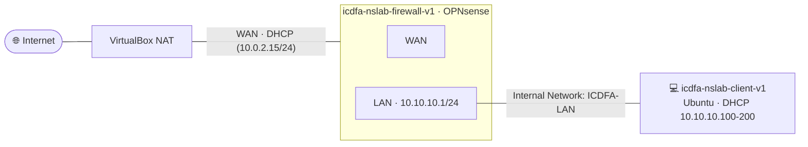

<div align="center">

# 🛡️ Two-VM Network Commissioning & Connectivity Verification

### WADF105 · Network Security Fundamentals · Practical Laboratory 1


*Build a small protected network, verify it layer by layer, and watch ARP, ICMP and DNS on the wire.*

</div>

---

## 📖 Overview

This lab builds a compact, firewall-protected network using only two virtual machines:

| VM | Role |
| --- | --- |
| `icdfa-nslab-firewall-v1` | OPNsense firewall: WAN toward the internet, LAN gateway for the protected network |
| `icdfa-nslab-client-v1` | Ubuntu workstation and packet-analysis host |

You will configure the VirtualBox adapters, confirm addressing and routing, reach the firewall management interface, test internet access, and observe **ARP, ICMP and DNS** traffic in Wireshark.

## 🎯 Learning Objectives

- Explain the purpose of **WAN** and **LAN** interfaces on a firewall.
- Configure a two-VM VirtualBox network without relying on fixed MAC addresses.
- Obtain or assign a valid IPv4 address, default gateway and DNS server.
- Verify local connectivity, routing, name resolution and internet access.
- Capture and identify **ARP, ICMP and DNS** packets in Wireshark.

## 🗺️ Target Topology



| Component | VirtualBox Connection | Expected Addressing | Purpose |
| --- | --- | --- | --- |
| Firewall **WAN** | Adapter 1: **NAT** | DHCP from VirtualBox, commonly `10.0.2.15/24` | Internet-facing interface |
| Firewall **LAN** | Adapter 2: **Internal Network** `ICDFA-LAN` | `10.10.10.1/24` | Protected network and default gateway |
| Client | Adapter 1: **Internal Network** `ICDFA-LAN` | DHCP, normally `10.10.10.100-200/24` | Student workstation and packet-analysis host |

## ⚙️ Resource Settings

| VM | Memory | Processors | Adapters |
| --- | --- | --- | --- |
| `icdfa-nslab-firewall-v1` | 2048 MB | 2 | NAT + ICDFA-LAN |
| `icdfa-nslab-client-v1` | 2048 MB minimum | 2 | ICDFA-LAN only |

---

## 🧪 Lab Procedure

### Part A · Prepare VirtualBox

> Shut down **both** VMs completely before changing adapter settings.

**Firewall (`icdfa-nslab-firewall-v1`)** → *Settings → Network*

1. **Adapter 1:** Enable Network Adapter → Attached to **NAT** → Cable Connected ✅
2. **Adapter 2:** Enable Network Adapter → Attached to **Internal Network** → name `ICDFA-LAN` → Cable Connected ✅
3. Disable unused Adapter 3 and Adapter 4.

**Client (`icdfa-nslab-client-v1`)** → *Settings → Network*

1. **Adapter 1:** Internal Network → name `ICDFA-LAN` → Cable Connected ✅
2. Disable all remaining adapters.

📸 **Evidence:** `screenshots/A1-firewall-adapter1.png`, `screenshots/A2-firewall-adapter2.png`, `screenshots/A3-client-adapter1.png`

### Part B · Verify OPNsense Interfaces

1. Start `icdfa-nslab-firewall-v1` and wait for the OPNsense console menu.
2. Confirm one interface is marked **WAN** and the other **LAN**.
3. Confirm the LAN address is `10.10.10.1/24`.

📸 **Evidence:** `screenshots/B1-opnsense-console.png`

### Part C · Verify Ubuntu Addressing

Start the client **only after** the firewall is ready, then in a terminal run:

```bash
ip -4 -br address
ip route
```

📸 **Evidence:** `screenshots/C1-ip-address-route.png`

### Part D · Connectivity Tests

Run the tests **in order**. Each one verifies a different layer, so don't jump straight to the internet test.

| # | Command | Expected Result | What It Proves |
| :-: | --- | --- | --- |
| 1 | `ping -c 4 10.10.10.1` | Replies received | Ubuntu can reach the firewall LAN interface |
| 2 | `ping -c 4 1.1.1.1` | Replies received | Routing and outbound NAT are working |
| 3 | `getent hosts opnsense.org` | One or more addresses returned | DNS name resolution is working |
| 4 | `curl -I https://opnsense.org` | HTTP response headers | TCP, TLS and web connectivity are working |

Then open a browser and visit **https://10.10.10.1**. Accept the self-signed certificate warning **only for this authorised local firewall**, sign in, and capture the dashboard showing WAN and LAN status.

📸 **Evidence:** `screenshots/D1-connectivity-tests.png`, `screenshots/D2-opnsense-dashboard.png`

### Part E · Observe Packets in Wireshark

1. Open Wireshark on Ubuntu and select the Ethernet interface carrying the `10.10.10.x` address.
2. Start the capture.
3. In a terminal, repeat:
   ```bash
   ping -c 4 10.10.10.1
   getent hosts opnsense.org
   ```
4. Stop the capture and apply each display filter:

| Filter | What to Identify |
| :-: | --- |
| `arp` | The request asking *who has 10.10.10.1* and the reply containing the firewall MAC address |
| `icmp` | Echo requests sent by Ubuntu and echo replies returned by OPNsense |
| `dns` | The DNS query for `opnsense.org` and the corresponding response |

📸 **Evidence:** `screenshots/E1-arp.png`, `screenshots/E2-icmp.png`, `screenshots/E3-dns.png`

**E7 · Why does the client use `10.10.10.1` as its default gateway?**

> `10.10.10.1` is the firewall's LAN interface, the only router on the `ICDFA-LAN` segment. Any destination outside `10.10.10.0/24` must be sent to it, and the firewall then forwards the traffic out through its WAN interface with NAT.

---

## 🩺 Troubleshooting Guide

| Problem | Likely Cause | Corrective Action |
| --- | --- | --- |
| Ubuntu gets no `10.10.10.x` address | DHCP disabled, or internal-network names don't match | Check both adapters use `ICDFA-LAN`; enable DHCP on OPNsense LAN; renew the Ubuntu lease |
| `10.10.10.1` can't be pinged | LAN adapter disconnected or assigned incorrectly | Confirm Cable Connected, verify interface assignment, check the OPNsense LAN address |
| `1.1.1.1` fails but `10.10.10.1` works | WAN, default route or outbound NAT problem | Confirm OPNsense WAN uses DHCP on NAT; review *System → Routes → Status* |
| Names fail but `1.1.1.1` works | DNS problem only | Review DHCP DNS settings and *Services → Unbound DNS*; renew the Ubuntu lease |
| Web interface certificate warning | Firewall uses a self-signed certificate | Proceed **only** to `https://10.10.10.1` inside the authorised lab; never ignore such warnings on unknown public sites |

---

## ❓ Completion Questions

<details>
<summary><b>1. What is the difference between the OPNsense WAN and LAN interfaces?</b></summary>

WAN faces the untrusted outside (here, VirtualBox NAT toward the internet) and gets its address by DHCP. LAN faces the protected internal network, has the static address `10.10.10.1/24`, and acts as the clients' gateway.
</details>

<details>
<summary><b>2. Why must both internal adapters use the same VirtualBox network name?</b></summary>

VirtualBox only connects adapters that share the same internal-network name into one virtual Layer 2 switch. With mismatched names, the client and firewall sit on separate segments and can't communicate.
</details>

<details>
<summary><b>3. What information does the default route provide to Ubuntu?</b></summary>

It tells Ubuntu which next-hop address (`10.10.10.1`) and interface to use for every destination that isn't on the local subnet.
</details>

<details>
<summary><b>4. Which packet exchange allows Ubuntu to learn the firewall MAC address?</b></summary>

ARP: Ubuntu broadcasts an ARP request ("who has 10.10.10.1?") and the firewall answers with an ARP reply containing its MAC address.
</details>

<details>
<summary><b>5. Why does a successful ping to 1.1.1.1 not prove DNS works?</b></summary>

Pinging an IP address needs no name lookup. It confirms routing and NAT only, so DNS can still be broken. That is why `getent hosts` is a separate test.
</details>

---

## 📁 Suggested Repository Structure

```text
.
├── README.md
└── screenshots/
    ├── A1-firewall-adapter1.png
    ├── A2-firewall-adapter2.png
    ├── A3-client-adapter1.png
    ├── B1-opnsense-console.png
    ├── C1-ip-address-route.png
    ├── D1-connectivity-tests.png
    ├── D2-opnsense-dashboard.png
    ├── E1-arp.png
    ├── E2-icmp.png
    └── E3-dns.png
```

## ✅ Checklist

- [ ] Both VMs shut down before editing adapters
- [ ] Firewall: Adapter 1 = NAT, Adapter 2 = `ICDFA-LAN`
- [ ] Client: Adapter 1 = `ICDFA-LAN`
- [ ] OPNsense LAN = `10.10.10.1/24`
- [ ] Client received a DHCP lease in `10.10.10.100-200`
- [ ] All four connectivity tests passed
- [ ] OPNsense dashboard captured
- [ ] ARP, ICMP and DNS packets identified in Wireshark

---

<div align="center">

**WADF105 · Network Security Fundamentals** · *For use in the authorised laboratory environment only.*

</div>
