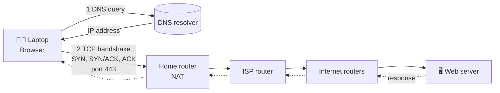

# 🔐 Opening a Secure Website
### Tracing HTTPS Communication Using the TCP/IP Model

*What really happens between pressing **Enter** on `https://example.com` and the page appearing?*

**Muhammad Haseeb** · WADF105 Network Security Fundamentals · October 2026

---

## 📖 About the Project

A technical presentation project completed as a junior network analyst. It follows one communication, **opening a secure website**, from the user's laptop to the web server and back, and explains every layer of the **TCP/IP model**: protocols, encapsulation and decapsulation, addressing, port numbers, network devices and the movement of data.

It also maps TCP/IP to OSI, compares TCP and UDP, and works through one realistic failure (a **DNS resolution failure**) using a structured troubleshooting method.

## 📦 What's Inside

| Folder | Content |
| --- | --- |
| [`presentation/`](presentation) | 12-content-slide PowerPoint with speaker notes and an editable packet journey diagram |
| [`vedio/`](vedio) | 45-second animated explainer |
| [`docs/`](docs) | Contribution record, declarations and the requirements audit |
| [`assets/`](assets) | Slide previews and screenshots |

## 🗺️ The Journey at a Glance

1. **DNS** resolves the domain name to an IP address.
2. **TCP** establishes a connection with the three-way handshake (destination port **443**).
3. **TLS** authenticates the server and encrypts the data, so HTTP becomes HTTPS.
4. Each layer **encapsulates** the data; routers forward packets using IP addresses.
5. The server **decapsulates** the request and sends the response back along the return path.

## 🧱 TCP/IP ↔ OSI Mapping

| TCP/IP layer | OSI layers | Examples here |
| --- | --- | --- |
| Application | 7 Application, 6 Presentation, 5 Session | HTTPS (HTTP + TLS), DNS |
| Transport | 4 Transport | TCP (443), UDP (53) |
| Internet | 3 Network | IP, ICMP |
| Network Access | 2 Data Link, 1 Physical | Ethernet, Wi-Fi, ARP |

## 🔬 Protocol Analysis

| Layer | Protocol | PDU | Addressing | Purpose |
| --- | --- | --- | --- | --- |
| Application | DNS | DNS message | Domain name | Resolves a name to an IP address |
| Application | HTTPS (HTTP over TLS) | HTTP message / TLS record | URL / domain | Secure web request and response |
| Transport | TCP | Segment | Port numbers (443) | Reliable, ordered delivery |
| Transport | UDP | Datagram | Port numbers (53) | Low-overhead delivery |
| Internet | IP | Packet | Source / destination IP | Routing between networks |
| Network Access | Ethernet / Wi-Fi | Frame | Source / destination MAC | Delivery on the local link |

> **Key points:** IP addresses stay the same end to end (NAT rewrites the private source at the home router), while **MAC addresses change at every hop**. TCP does not encrypt; **TLS** provides the security.

## ⚖️ TCP vs UDP

| | TCP | UDP |
| --- | --- | --- |
| Connection | Connection-oriented (handshake) | Connectionless |
| Reliability | Acknowledgements, retransmission | No delivery guarantee |
| Ordering | Sequence numbers | Not ordered |
| Overhead | Higher | Lower |
| Examples | HTTPS, SSH | DNS, online gaming, real-time media |

UDP is not simply "faster": it has lower overhead and none of TCP's reliability mechanisms. **HTTP/3** uses QUIC over UDP; this project presents the traditional HTTPS-over-TCP flow.

## 🛠️ Troubleshooting: DNS Resolution Failure

**Symptom:** `https://example.com` does not open, although other connectivity may work.

| Stage | Action |
| --- | --- |
| **Identify** | `ipconfig /all` to check IP, gateway and DNS servers |
| **Diagnose** | `ping 8.8.8.8` (IP path) and `nslookup example.com` (name resolution); if IP works but DNS fails, check the DNS server, client settings and router/DHCP |
| **Resolve** | Correct the DNS configuration or use a working resolver suited to the network |
| **Verify** | `nslookup example.com`, then reopen the website |

A successful ping to an IP address does **not** prove DNS works.

## 🎬 Explainer Video

Open [`video/https_explainer.html`](video/https_explainer.html) in a browser and press **Play**. The animation runs about 45 seconds with captions, optional browser voiceover and ambient audio.

## 📚 References

- IETF, *RFC 9293: Transmission Control Protocol (TCP)*, 2022. https://www.rfc-editor.org/info/rfc9293
- IETF, *RFC 768: User Datagram Protocol*, 1980. https://www.rfc-editor.org/info/rfc768
- IETF, *RFC 791: Internet Protocol*, 1981. https://www.rfc-editor.org/info/rfc791
- IETF, *RFC 1035: Domain Names, Implementation and Specification*, 1987. https://www.rfc-editor.org/info/rfc1035
- IETF, *RFC 8446: TLS Protocol Version 1.3*, 2018. https://www.rfc-editor.org/info/rfc8446
- IETF, *RFC 9114: HTTP/3*, 2022. https://www.rfc-editor.org/info/rfc9114

## 👤 Author

**Muhammad Haseeb**. Completed individually as an academic project.

© 2026 Muhammad Haseeb. Shared for educational and portfolio viewing.
